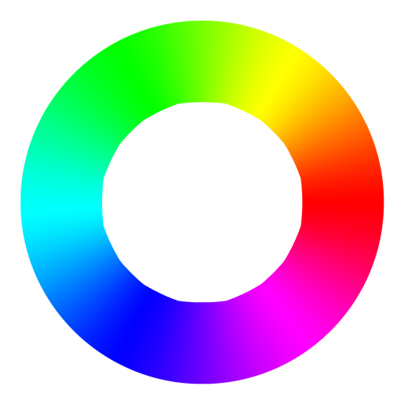

# ColorStrap

<div align="center">
  
  <h3>Ferramentas avançadas para trabalhar com cores</h3>
  
  [](https://colorstrap.vercel.app/)
  [](https://github.com/LuisT-ls/ColorStrap/blob/main/LICENSE)
  [](https://github.com/LuisT-ls/ColorStrap/stargazers)
  [](https://github.com/LuisT-ls/ColorStrap/issues)
  [](https://github.com/LuisT-ls/ColorStrap/releases)
</div>

ColorStrap é uma plataforma completa para desenvolvedores e designers trabalharem com cores. Através de uma interface intuitiva e ferramentas poderosas, oferecemos tudo o que você precisa para criar, gerenciar e testar paletas de cores para seus projetos web.

**[Visite ColorStrap](https://colorstrap.vercel.app/)**


## 🎨 Ferramentas e Funcionalidades

ColorStrap oferece uma ampla gama de ferramentas para trabalhar com cores:

### Gerador de Paletas de Cores

- Crie paletas harmônicas com diferentes modos (análogas, complementares, triádicas, etc.)
- Gere paletas aleatórias com configurações personalizáveis
- Salve suas paletas favoritas localmente

### Conversor de Cores

- Converta entre formatos HEX, RGB, e HSL
- Visualize resultados em tempo real
- Interface intuitiva com seletor de cores visual

### Gerador de Gradientes

- Crie gradientes com múltiplas cores e direções
- Visualize gradientes em tempo real
- Copie o código CSS gerado diretamente

### Esquemas de Cores

- Visualize diferentes esquemas de cores a partir de uma cor base
- Explore harmonias monocromáticas, análogas, complementares e muito mais
- Exporte facilmente para uso em seus projetos

### Roda de Cores Interativa

- Explore relações entre cores com uma roda de cores totalmente interativa
- Visualize harmonias como complementares, análogas, triádicas e tetrádicas
- Entenda melhor a teoria das cores com exemplos visuais

### Verificador de Contraste de Cores

- Verifique a acessibilidade WCAG de suas combinações de cores
- Visualize o contraste entre texto e fundo
- Receba feedback sobre conformidade com WCAG AA e AAA

### Simulador de Daltonismo

- Teste como suas cores são percebidas por pessoas com diferentes tipos de daltonismo
- Faça upload de imagens para simular como seriam vistas com diferentes tipos de daltonismo
- Garanta que seu design seja acessível para todos

## 🚀 Tecnologias Utilizadas

ColorStrap é construído utilizando tecnologias web modernas e princípios de design responsivo:

- **HTML5**: Estrutura semântica e acessível
- **CSS3**: Design responsivo e temas claro/escuro
- **JavaScript (ES6+)**: Funcionalidades interativas e manipulação de cores
- **Bootstrap 5**: Framework front-end para UI responsiva
- **Chroma.js**: Biblioteca avançada para manipulação de cores
- **PWA**: Funcionalidades de Progressive Web App para uso offline
- **Arquitetura Modular**: Código organizado em componentes reutilizáveis

## 💡 Como Usar

### Acesso Online

Visite [colorstrap.vercel.app](https://colorstrap.vercel.app/) para acessar todas as ferramentas sem necessidade de instalação.

### Instalação Local

1. Clone o repositório:

   ```bash
   git clone https://github.com/LuisT-ls/ColorStrap.git
   ```

2. Navegue até o diretório do projeto:

   ```bash
   cd ColorStrap
   ```

3. Abra o arquivo `index.html` no seu navegador preferido ou utilize um servidor local.

### Desenvolvimento

Para contribuir ou modificar o projeto:

1. Fork o repositório
2. Clone seu fork localmente
3. Faça suas alterações
4. Envie um Pull Request

## 📁 Estrutura do Projeto

```
.
├── ./assets
│   ├── ./assets/css         # Arquivos CSS organizados por funcionalidade
│   ├── ./assets/img         # Imagens e recursos visuais
│   └── ./assets/js          # JavaScript organizado em módulos
├── ./index.html             # Página principal
├── ./LICENSE                # Informações de licença
├── ./pages                  # Páginas adicionais
└── ./README.md              # Documentação
```

O projeto segue a metodologia CSS BEM (Block Element Modifier) e uma arquitetura JavaScript modular para facilitar a manutenção e expansão.

## 🔧 Recursos para Desenvolvedores

### API de Cores

ColorStrap expõe algumas funções úteis para desenvolvedores trabalharem com cores:

```javascript
// Exemplo de conversão de cores
const hexColor = '#3498db'
const rgbColor = ColorStrap.convertHexToRgb(hexColor)
console.log(rgbColor) // "rgb(52, 152, 219)"

// Exemplo de geração de paleta
const baseColor = '#3498db'
const palette = ColorStrap.generateAnalogousPalette(baseColor, 5)
console.log(palette) // Array de cores análogas
```

Veja a documentação completa da API no nosso [Wiki](https://github.com/LuisT-ls/ColorStrap/wiki).

## 🌙 Tema Escuro

ColorStrap suporta nativamente tema claro e escuro, com alternância automática baseada nas preferências do sistema ou controle manual através do botão de tema no cabeçalho.

## 📱 Suporte a Dispositivos Móveis

ColorStrap é totalmente responsivo e otimizado para uso em dispositivos móveis, tablets e desktops.

## 🔒 Privacidade

ColorStrap respeita sua privacidade:

- Não rastreia dados pessoais
- Não envia informações para servidores
- Todo o processamento é realizado localmente no navegador
- As paletas salvas são armazenadas apenas no armazenamento local do seu navegador

## 📋 Roadmap

Funcionalidades planejadas para futuras versões:

- [ ] Exportação de paletas para vários formatos (Adobe, Sketch, Figma)
- [ ] Extração de cores a partir de imagens
- [ ] Mais formatos de cores (CMYK, LAB, etc.)
- [ ] Sincronização de paletas via conta de usuário
- [ ] API pública para integração com outras ferramentas

Veja nosso [projeto no GitHub](https://github.com/LuisT-ls/ColorStrap/projects) para mais detalhes.

## 🤝 Contribuindo

Contribuições são bem-vindas! Veja como você pode ajudar:

1. Reporte bugs ou sugira funcionalidades abrindo uma [Issue](https://github.com/LuisT-ls/ColorStrap/issues)
2. Envie correções ou novas funcionalidades através de Pull Requests
3. Melhore a documentação

Leia nosso [Guia de Contribuição](CONTRIBUTING.md) para mais detalhes.

## 📄 Licença

ColorStrap é licenciado sob a licença MIT. Veja o arquivo [LICENSE](LICENSE) para mais detalhes.

## 👨‍💻 Autor

- **Luis Antonio Souza Teixeira** - [@LuisT-ls](https://github.com/LuisT-ls)

## 🙏 Agradecimentos

- Agradecimentos a todos que contribuíram com o projeto
- [Chroma.js](https://gka.github.io/chroma.js/) pela excelente biblioteca de manipulação de cores
- [Bootstrap](https://getbootstrap.com/) pelo framework CSS
- [Font Awesome](https://fontawesome.com/) pelos ícones

---

<p align="center">
  Feito com ❤️ pela equipe ColorStrap
</p>
